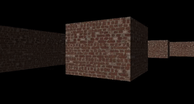

Simple raycasting engine implemented with Raylib for rendering.

## Features

	* Raycasting using dda
	* Textured walls
	* Collisions

## TODO
	* Textured ceilling
	* Custom resolutions
	* More textures
	* Map Editor

